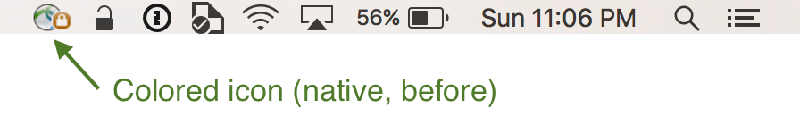
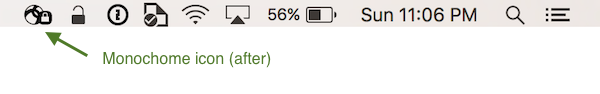

Cisco AnyConnect MacOS X Menubar
================================

Pretty MacOS X menu bar assets for Cisco AnyConnect Security Mobility Client.

Do you use Cisco AnyConnect for VPN in your MacOS and do not like the native menu bar icons? Did you notice that it looks awful next to all the nice monochrome icons? Now, you can change this!

Here are some assets that can be used to replace the native item.




Install
-------

To install, you only have to:

- Download the [assets in `Resources.zip`](https://github.com/rarylson/anyconnect-macosx-menubar/raw/master/Resources.zip);
- Unzip these files;
- Open Finder and Find `Cisco AnyConnect Secure Mobility Client.app`. It's probably in your Applications folder under a Cisco folder;
- Right-click the application and select "Show Package Contents";
- Open the "Contents" folder, and "Resources" folder;
- Drag the new images files into the "Resources" folder;
    - You may need to "Authenticate" with your password if your Applications folder is protected;
- Quit Cisco AnyConnect and open it again.

### Install using terminal

- Download the assets in `Resources.zip`:
    ```sh
    wget https://github.com/rarylson/cisco-anyconnect-macos-toolbar/raw/master/Resources.zip
    ```
- Assuming that your Cisco AnyConnect Secure Mobility Client app is in `/Applications/Cisco`, and you've downloaded `Resources.zip` to the current directory, you can just run:
    ```sh
    sudo unzip -d '/Applications/Cisco/Cisco AnyConnect Secure Mobility Client.app/Contents/Resources/' Resources.zip
    ```

### Caveats

- This doesn't change the software, just puts some more images in the application's resource folder. If you plan on switching back to the previous menu bar icon, just delete the new images.

License
-------

This project is released under the [Revised BSD License](LICENSE).

Thanks to
---------

This project is based on:

- [Project anyconnect-dark, by leebyron](https://github.com/leebyron/anyconnect-dark/blob/master/README.md);
    - Idea and instructions;
- [iconscout.com - Cisco anyconnect Icon](https://iconscout.com/icon/cisco-anyconnect);
    - The main icon itself.

References
----------

- [developer.apple.com - Human Interface Guidelines - Menu Bar Extras](https://developer.apple.com/design/human-interface-guidelines/macos/extensions/menu-bar-extras/).

TODO
----

- Use template images to represent menu bar extra icons, as explained in [developer.apple.com - Human Interface Guidelines - Menu Bar Extras](https://developer.apple.com/design/human-interface-guidelines/macos/extensions/menu-bar-extras/);
    - With the current images, the resolution is not good and we'll have problems when using a dark menu bar.
